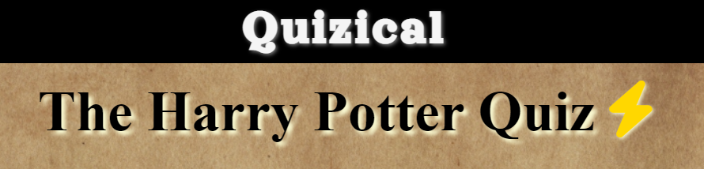
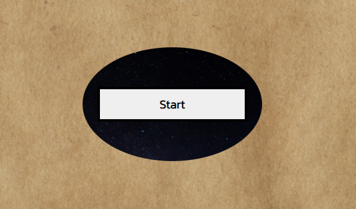
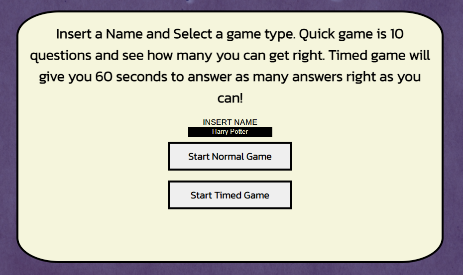
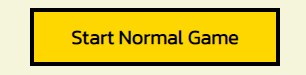
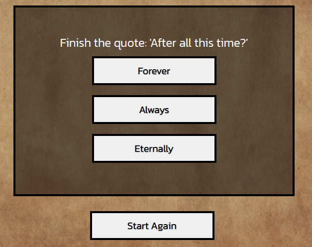
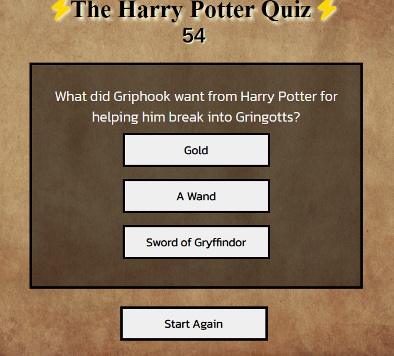
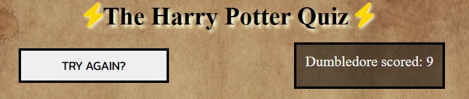
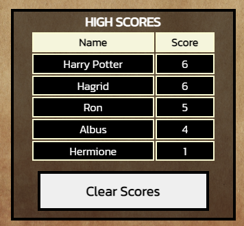

___
# **Quizical**

Quizical is the perfect place to test your Harry Potter knowledge. If it's just a case of testing your knowledge trying questions or if you want to put your knowledge to the test and try to answer as many questions right in 1 minute. Most quizzes will give you a certain amount of questions and give you a score out of the number of questions, whereas this quiz will give you the opportunity to try and get the highscore and see if your friends can beat your score. The quiz is for all ages and all knowledge levels. The questions range from easy to hard, so you should be able to really test how much you know. 

___
## **Motivation** ##
I am a Harry Potter fan and I would love to see how much I really know. This website would have given me that opportunity to test my knowledge. I would like a quiz game which you could play with your friends. So in my head I thought a quiz which you could pass around and see who could get the best score sounded perfect. 
___
## **Features** ##
___
### **Opening Screen** ###
The opening page has the website name at the very top of the page so that it stands out the most. This will stay there on the site throughout. The intro line gives the user an instant insite as to what the quiz is about.

The opening page is set so that it looks like the portal to a game. The circle in the middle with the starry background with the start button positioned in the middle is to make the user make it feel like they are entering a magical world.

- start button will change colour when hovered over so that the user knows that it is interactable. 
- curser will also change shape to a pointer to indicate that it is interactable too.

The background looks like the mauraders map in Harry Potter 
- help the user identify what the quiz is about.

### **Modal** ###
The modal provides the user with the different game buttons. Depending on what game they chose to play the corresponding game will load. Modal also give the user an explanation as to what each quiz does. User can also input a desired playing name here too.

- buttons will turn yellow and curser will change to a pointer. This will show the user that the buttons are clickable.
- modal will display in the centre and will cause the behind background to change transparancy so that the users attention will be drawn to the modal.
- text input area gives the oppotunity to pick a desired name for them to play as. Harry Potter is put in there by default in case the user forgets to put a name.
- if user puts nothing in the input then a name will be saved for them (player 1), this will stop any delay to the game in case the user just wants to play the quiz and not bothered about saving a name, this javascipt will make it userfriendly for both types of users who want to play.
- username has a limit to the amount of characters to make the leaderboard display more user friendly as it will fit the given container.
- information is given to the user at this point so that they decide what game type they would like to play, rather than trying to figure out what each one does.

### **Questions and Answers** ###

Once the gametype the user wants to play has been selected the quiz questions will appear. The questions are displayed on top so the user will read that first then the answer options are displayed below in the same format as all previous buttons so that the user "knows the drill".

- normal gametype will display just the questions and answers

- timed game displays a timer above the questions so that the user knows how long they have.

### **end game** ###

At the end of the quiz, the users score for that game will be displayed, along with a leaderboard. The leaderboard has space for 5 scores. If the user beats the scores that are already there, then the lowest will be taken off. 

- the chosen name for the user and their score is displayed at the top right. If the user doesn't beat the highscore, they can still see how they have done. 
- try again button is displayed so that the user gets the chance to try again or pass the quiz to their friend to see if they can beat their score.

- a clear score button is provided so if the user wants to clear all previous highscores they can and start adding new scores to the table.

___

### **Images** ###

The images used in the quiz have been Harry Potter or magic related. I got my images from - [pexels.com](https://www.pexels.com/)
___

## **Features For Future** ##
___
- a larger leaderboard which will display scores from online so that you can try and beat people from all over the world.
- a live 2 player game where you can play at the same time and see who can get a better score whilst seeing what your opponant is on.
- a choice of quiz topics.
- video clips from the movie where users can answer questions like 'what does Harry say next?'

 

